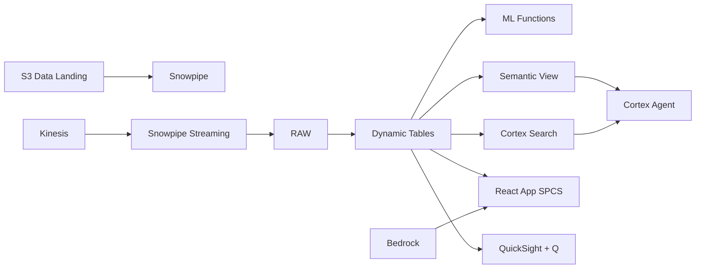

# Commodity Trading Intelligence

Real-time CPO trading analytics for MDEX — Snowpipe Streaming ingests price feeds, ML.FORECAST predicts CPO prices, and Cortex Agent answers trading queries in natural language.

## Architecture

A Malaysian palm oil trading house operates on Bursa Malaysia Derivatives (MDEX), managing RM 2.8B in monthly CPO futures and physical trading volume. Three margin calls triggered this month as back-month spreads widened unexpectedly. The Head of Trading needs real-time position risk visibility, price forecasts, and instant access to market intelligence — without waiting for overnight batch reports.



## Snowflake Capabilities

| Capability | Implementation |
|-----------|---------------|
| Dynamic Tables | POSITION_RISK_SUMMARY / CPO_PRICE_TIMESERIES / HEDGE_EFFECTIVENESS / TRADING_PNL |
| ML Functions | ML.FORECAST + ML.ANOMALY_DETECTION |
| Cortex AI | SUMMARIZE, AI_EXTRACT, AI_CLASSIFY |
| Cortex Search | 100 documents indexed |
| Cortex Agent | TRADING_INTELLIGENCE_AGENT |
| Semantic View | TRADING_ANALYTICS |
| React App (SPCS) | 5 tabs + DemoGuide |


## AWS Services

| Service | Role in Demo |
|---------|-------------|
| Amazon Kinesis | Stream real-time MDEX price feeds to Snowpipe Streaming |
| Amazon EventBridge | Event-driven margin call and position limit alerts |
| Amazon Bedrock (Claude) | Generate trading commentary and market summaries |
| Amazon QuickSight + Q | Trading desk dashboard with natural language queries |
| Amazon S3 | Store market reports and historical price archives |
| AWS Lambda | Real-time margin calculation and position limit enforcement |


## Personas

| Persona | Role | Key Questions |
|---------|------|---------------|
| **Encik Rizal bin Osman** | Head of Trading | "What's our total trading volume this month?" "Which positions are at risk of margin call?" |
| **Michelle Tan** | Commodity Analyst | "What's driving the CPO premium over spot?" "Show me the price-volume correlation for the front month." |


## Data

| Table | Rows | Description |
|-------|------|-------------|
| CPO_TRADES | 100,000 | MDEX CPO futures trades with price, volume, and counterparty |
| POSITIONS | 5,000 | Open trading positions with mark-to-market and margin requirements |
| MDEX_PRICES | 50,000 | Tick-level CPO futures prices from Bursa Malaysia Derivatives |
| HEDGE_RECORDS | 2,000 | Physical-to-derivative hedge linkages and effectiveness tracking |
| MARKET_REPORTS | 100 | Analyst reports, MPOB monthly data, USDA WASDE, and broker research |
| COUNTERPARTIES | 200 | Trading counterparties with credit ratings and exposure limits |
| CPO_PRICE_HISTORY | 10,000 | Daily CPO settlement prices for ML.FORECAST training (10 years) |


## Build Instructions

### Prerequisites
- Snowflake account with ACCOUNTADMIN access
- Cortex AI enabled (ML Functions, Search, Agent)
- Warehouse: TRADING_WH (Medium)
- AWS CLI with access (us-west-2)

### Deployment

```bash
snowsql -f snowflake/00_setup.sql
snowsql -f snowflake/01_marketplace_install.sql
snowsql -f snowflake/02_raw_tables.sql
snowsql -f snowflake/03_staging.sql
snowsql -f snowflake/04_dynamic_tables.sql
snowsql -f snowflake/05_search.sql
snowsql -f snowflake/06_ml_models.sql
snowsql -f snowflake/07_semantic_view.sql
snowsql -f snowflake/08_agent.sql
```

### React App (SPCS)
```bash
cd app && npm ci && npm run build
docker build -t aws-malaysia-palm-oil-trading-app .
docker push bdiqc8sm-default.registry.snowflakecomputing.com/palm_oil_trading/app/aws_malaysia_palm_oil_trading/app:latest
```

### Demo Mode
Open the app URL with `?demo=true` for presenter view.

## Build Modes

### Snowflake Only
Run scripts 00-08 (skip AWS-specific integration). Uses:
- **Snowpipe Streaming SDK (direct)** instead of Amazon Kinesis
- **Snowflake Alerts + Notification Integration** instead of Amazon EventBridge
- **Cortex Complete** instead of Amazon Bedrock (Claude)
- **Snowflake Intelligence (Cortex Analyst)** instead of Amazon QuickSight + Q
- **Snowflake Internal Stage + Directory Tables** instead of Amazon S3
- **Dynamic Tables + Alerts** instead of AWS Lambda

### Full AWS + Snowflake
Run all scripts including AWS integration. Deploy QuickSight dashboard from `quicksight/`.

## Business Impact

Industry research and Snowflake customer outcomes:
- **Bursa Malaysia Derivatives (MDEX) CPO futures traded RM 120B notional volume in 2023** — [Bursa Malaysia](https://www.bursamalaysia.com/trade/our_products_services/derivatives/commodity_derivatives)
- **Malaysia accounts for 27% of global palm oil exports, with CPO as the benchmark pricing contract** — [MPOB](https://bepi.mpob.gov.my/)
- **Real-time risk analytics reduces margin call events by 35% through early warning systems** — [McKinsey Commodities](https://www.mckinsey.com/industries/electric-power-and-natural-gas/our-insights/commodity-trading)
- **AI-powered trading analytics improves hedge effectiveness by 8-15% for commodity desks** — [Deloitte Trading](https://www.deloitte.com/us/en/Industries/financial-services/perspectives.html)
- **Honeywell** (Snowflake customer): connects 500K+ machines on Snowflake, enabling precision agriculture analytics across 400M+ acres globally -- [snowflake.com/customers/honeywell](https://www.snowflake.com/en/customers/all-customers/video/honeywell/)

## Key Demo Numbers

- **RM 2.8B** monthly trading volume (futures + physical)
- **5,000 open positions** across CPO futures and physical contracts
- **$42/tonne premium** CPO futures premium vs spot price
- **3 margin calls** triggered this month on back-month spreads
- **100 market reports** indexed in Cortex Search
- **92% hedge effectiveness** declining from 97% (policy minimum: 90%)
- **RM 4,280/tonne** ML.FORECAST predicted front-month CPO settlement


## License

Apache 2.0 — See [LICENSE](LICENSE) for details.

This is a personal demo project and is not an official Snowflake offering. It comes with no support or warranty.